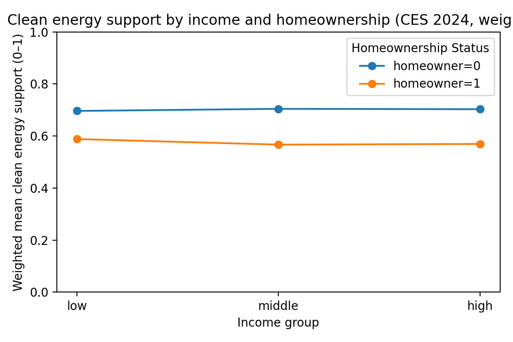
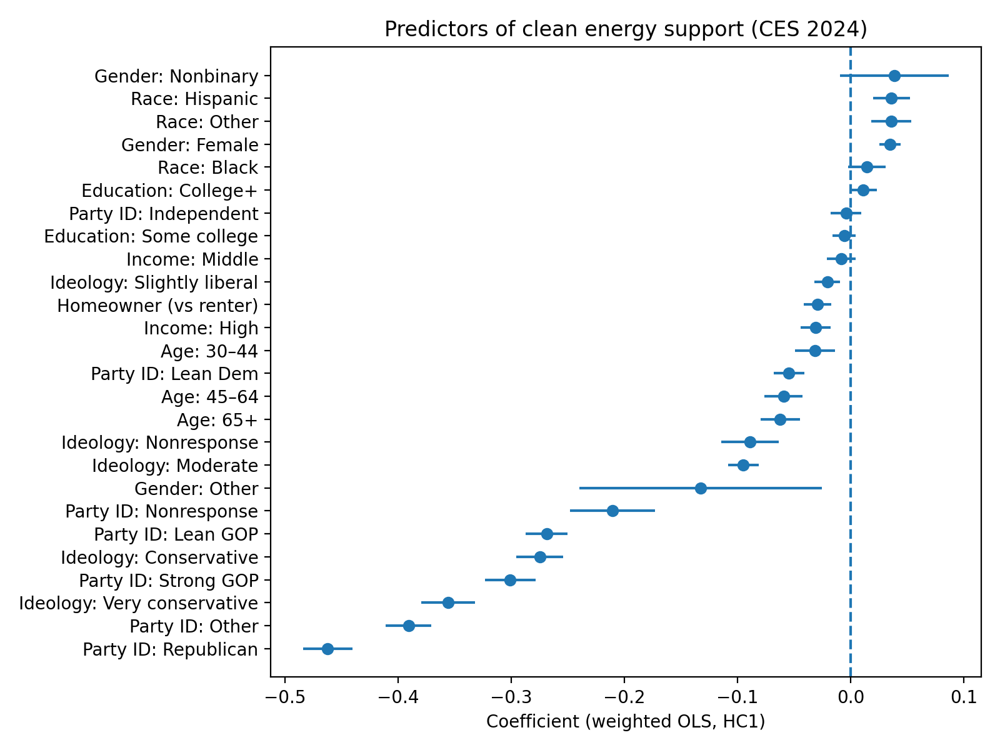
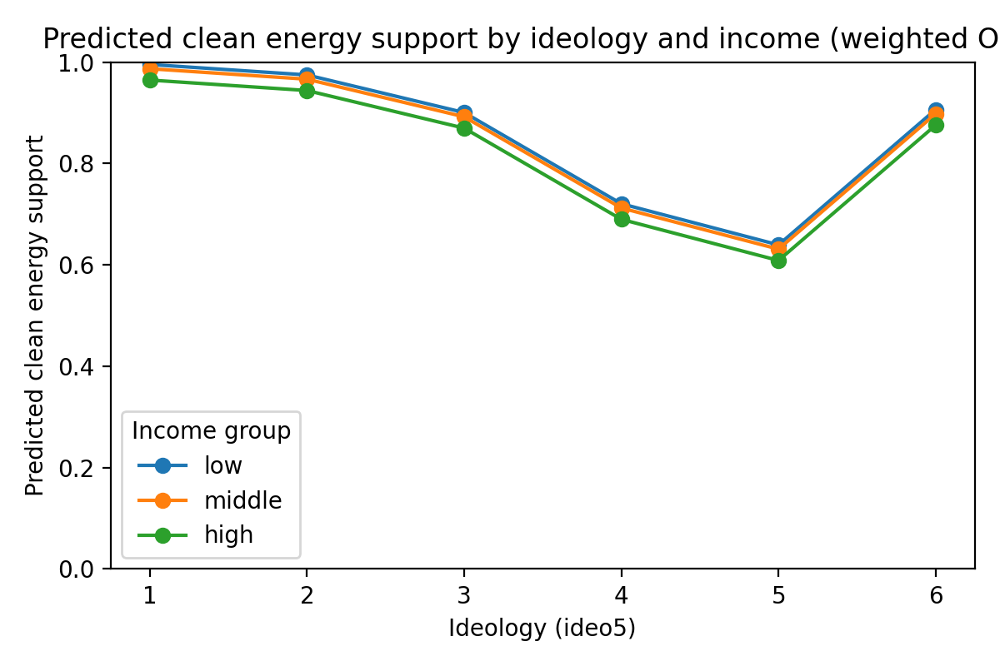

## Motivation and Question

Public support for clean energy and environmental regulation is often described in ideological or partisan terms. While political orientation is clearly important, less attention has been paid to how material position, particularly in terms of housing tenure, may independently structure climate policy attitudes.

In what follows, I explore whether homeownership predicts support for clean energy policies after controling for the factors that are often thought as determining such suuport: political party affiliation, politcal ideology, and income.

Using nationally representative survey data from the 2024 Cooperative Election Study (CES), I show that homeownership is associated with lower support for clean energy policies even after accounting for political orientation and standard socioeconomic controls. This pattern suggests that climate attitudes may reflect not only ideology, but also individuals’ positions within housing and asset structures that shape exposure to regulation and perceived costs.

## Data and Variables

This analysis uses the 2024 CES Common Content, which is weighted to approximate national representativeness. After cleaning the key variables, the sample used in the final analysis includes about 56,000 respondents.

The primary outcome variable for my analysis is clean_energy_support, a composite index designed to capture support for a range of environmental and clean energy policies. This variable is constructed as the mean of multiple binary variables taken as outcomes from the CES survey, including support for:

-EPA regulation of carbon dioxide emissions

-Renewable electricity generation requirements

-Strengthened enforcement of the Clean Air and Clean Water Acts

-Restrictions on fossil fuel expansion and new oil and gas leases

The variable ranges from 0 to 1, with higher values indicating stronger overall support for clean energy and environmental regulation. 

## Descriptive Patterns: Income, Homeownership, and Clean Energy Support

Figure 1 presents weighted mean levels of clean energy support by income group and homeownership status:

{fig-alt="Clean energy support by income and homeownership"}

Two patterns stand out from this graph. Renters exhibit consistently higher support for clean energy policies than homeowners, across all income groups, and income differences within tenure groups are relatively small, especially among renters. Among renters, support for clean energy policies is high (approximately 0.70 on a 0–1 scale) regardless of income. Among homeowners, support is substantially lower (roughly 0.57–0.59), again with little variation by income. These patterns suggest that housing tenure may be more strongly associated with climate attitudes than income alone, as will be explored further below.

## Weighted OLS Results: Does Homeownership Matter Net of Politics?

To assess whether the observed tenure gap reflects political sorting, I estimate a weighted least squares (WLS) regression of clean energy support on:

-   Party identification

-   Political ideology

-   Income group

-   Education level

-   Homeownership status

-   Age, gender, and race/ethnicity

Figure 2 displays coefficient estimates with 95% confidence intervals:

{fig-alt="Coefficient plot from weighted OLS model"}

As expected from the "common sense" view of how views of such policies are distributed, party identification and political ideology are the strongest predictors of clean energy support. Moving from liberal to conservative ideological categories is associated with large declines in support, and partisan differences are substantial.

However, even after accounting for these political variables, homeownership remains negatively associated with clean energy support. The estimated effect is modest in magnitude (approximately −0.03 on a 0–1 scale), but statistically significant and comparable to or larger than the effect of moving between income categories.

Table 1 presents a regression table with predictor names.

```{=html}

```

Notably, high incomes are weakly associated with lower support, while middle incomes show little difference relative to low incomes. In addition, education's effects are small once political orientation is controlled for. The homeowner coefficient remains negative net of all controls.

These results indicate that housing tenure captures something distinct from income and ideology, likely related to asset ownership, exposure to energy costs, or perceived regulatory risk.

## Predicted Values: Visualizing the Tenure Gap

To make these results more intuitive, Figure 3 plots predicted levels of clean energy support across the ideological spectrum, holding other covariates constant:

{fig-alt="Predicted clean energy support by ideologg and income (weighted)"}

This graphic suggests that, quite unsusprisingly, ideology strongly structures climate attitudes, with steep declines in suport from liberal to conservative positions. However, income differences are modest at most ideological levels, and homeownership shifts the entire curve downward, indicating lower support across ideological positions. In other words, homeowners are less supportive of clean energy policies even when they share similar ideological positions with renters.

## Interpretation and Implications

Taken together, these findings suggest that support for clean energy policy is shaped not only by ideology and partisanship, but also by material position within the housing system. Homeownership appears to be associated with lower support for environmental regulation in ways not reducible to income or political identity.

One plausible interpretation is that homeowners face different perceived costs and risks from climate and energy regulation, including concerns about housing retrofits, energy prices, or property values. While the CES cannot directly test these mechanisms, the results point to the importance of considering tenure and asset exposure when analyzing public opinion on climate policy.

More broadly, this analysis demonstrates that survey data, often criticized for capturing only “attitudes”,can still be used to study structured differences linked to social position, especially when variables are interpreted relationally rather than as isolated preferences.

## Limitations and Next Steps

This analysis is descriptive and cross-sectional; therefore causal interpretations should be avoided without further work. Additionally, the clean energy support index weights all component items equally, which may obscure percieved differences in the in the percieved impact or importance of specific policies.

Future work could:

-Examine individual policy items as robustness checks

-Incorporate geographic context or energy cost measures

-Explore longitudinal changes in tenure and climate attitudes

Nonetheless, the present results provide clear evidence that housing tenure is an underappreciated dimension of class relevant to understanding support for climate friendly politics.

## Methods

[View the repo for this project on my GitHub](https://github.com/bmdknndy/HomeOwnershipClimatePolicySupport)

To reproduce:

1.  run all DuckDB SQL scripts in sql/ folder

2.  run notebooks/01_analysis.ipynb

3.  run report/brief.ipynb

For additional details on methods, run notebooks/03_methods_appendix.ipynb

***Brady Kennedy***
